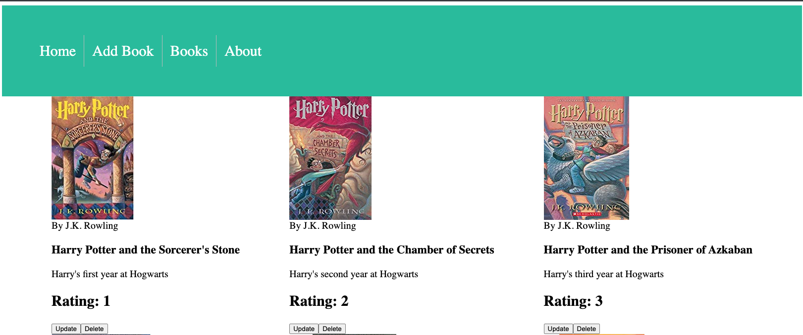
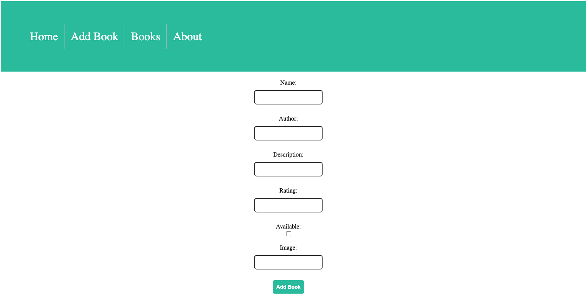
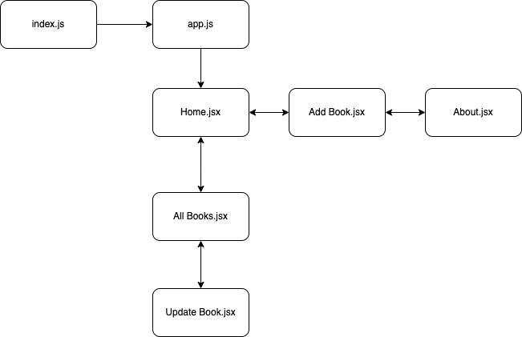
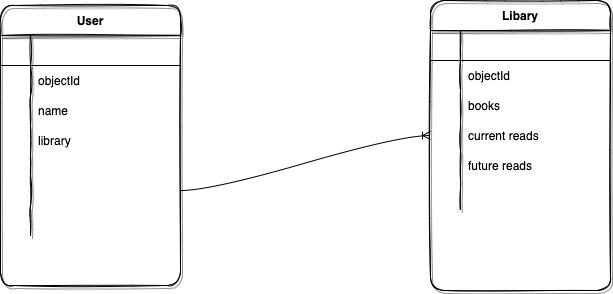

# **_*Book Shelf*_**

## Date: 10/30/2022

### By: Kevin Blanco

#### [Trello Board](https://trello.com/b/FMWy77pS/bookshelf-crud-app) | [GitHub](https://github.com/greensharpie)| [Repo Link](https://github.com/greensharpie/BookShelf) | [Heroku](https://bookshelf-crud.herokuapp.com/)

---

### **_*Description*_**

#### This app will help you keep track of your books.

 

#### The MVP for this project will function from user input data. With the help of this CRUD app the user will be able to add, update, and delete books.

 

 

 

---

### **_Technologies_**

- MongoDB & Mongoose
- Express.js
- React.js
- Node.js

---

### **_Component Hierarchy Diagram_**

### **_Entity Relationship Diagram_**

## 

### **_Task Lists_**

- [x] Be a new repo. Create a new repo in your github and build your project there. DO NOT name your repository Project 2, give it a real name.
- [x] Be written using the languages and frameworks learned in this course so far
- [x] Not be written using any other languages or frameworks not covered in this course so far (TypeScript, Sass, jQuery, UI Frameworks, etc.)
- [x] Have a separate directory for the frontend (client) and have your backend within the main repository.
- [x] Include a beautiful, professional README.md (use markdown)
- [x] Your README should have your name, links to socials, a detailed description of your project, technologies used, a getting started section (with links to your deployed site and Trello), screenshots of your final product (no more than 2-3), future updates, and credits.
- [x] Utilize flexbox or grid (or both)
- [x] Include a minimum of 2 Mongoose Schemas (models)
- [x] Have Full CRUD (CREATE, READ, UPDATE, DELETE) operations
- [x] Display data from each model on the frontend (unless given an exemption on one by an Instructor)
- [x] Must be able to navigate between different pages (React Router)
- [x] Have at least 40 meaningful git commits. You should be committing your changes every time you build a new feature.
- [x] Your code should be properly indented, spaced, and within code blocks. DO NOT leave in commented out code that was left unused (bad practice). Comments should be in your code to describe what your functions are doing.
- [x] Be deployed on Heroku

---

### **_Future Updates_**

- User Authentication
- Mobile Friendly
